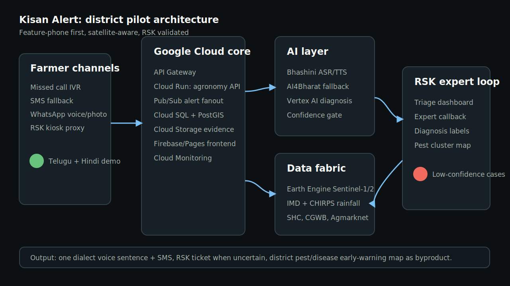

# Kisan Alert Project Write-up

## Problem

Small and marginal farmers face crop failure because sowing and input decisions are often made from habit, hearsay, or input-dealer pressure rather than plot-level soil, water, rainfall and crop-stage evidence. Generic apps and helplines exist, but adoption breaks when advice is app-first, too broad, or not trusted locally.

## Solution

Kisan Alert is a voice-and-SMS agricultural intelligence platform for Indic languages. It gives each farmer a short, plot-specific answer:

> "Avoid paddy this week. After the next 10 mm rain, sow 1.5 acres red gram and 0.5 acre maize. Expected seed-risk saving: Rs 3,800."

The platform has three connected components:

1. Smart crop recommendation engine using soil, satellite, rainfall, groundwater and price data.
2. Real-time dry-spell and irrigation/fertilization advisories using forecasts, crop stage and FAO-56 style water requirement.
3. Photo/voice crop-health logging with confidence-gated AI diagnosis and RSK expert follow-up.

## Differentiation

Kisan Alert is not another Kisan Suvidha clone or KCC replacement. It is a personalization and triage layer on top of public systems:

- Kisan Suvidha gives useful information.
- KCC answers farmer questions.
- mKisan broadcasts advisories.
- Kisan Alert combines those rails with plot-specific evidence, voice-first access, satellite signals and RSK validation.

## Tools And Data

| Layer | Tools / Data |
| --- | --- |
| Channels | Exotel/Twilio IVR, SMS, WhatsApp voice, RSK kiosk |
| Language | Bhashini ASR/TTS, AI4Bharat IndicWhisper and IndicTrans2 fallback |
| Cloud | Google Cloud Run, API Gateway, Pub/Sub, Cloud SQL/PostGIS, Cloud Storage, Vertex AI, Earth Engine |
| Soil | Soil Health Card N/P/K, pH, EC, organic carbon; SoilGrids fallback |
| Satellite | Sentinel-1 SAR for wetness under clouds; Sentinel-2 NDVI/NDWI when clear |
| Weather | IMD block forecast, GFS fallback, CHIRPS rainfall climatology |
| Water | CGWB groundwater depth, local borewell reports, optional soil-moisture sensors |
| Market | Agmarknet mandi prices, MSP list, crop input-cost assumptions |

## Architecture



## AI / Technical Execution

The crop engine uses a transparent scoring model for the hackathon:

```text
crop_score =
  soil_suitability
  * rainfall_reliability
  * water_feasibility
  * expected_margin
  * market_protection
  - risk_penalty
```

Risk penalty includes groundwater stress, rainfall variance, price volatility, crop duration risk and forecast dry-spell probability.

The dry-spell engine defines stress by crop stage:

- Germination: no effective rain above 10 mm for 5-7 days after sowing.
- Vegetative: forecast ET deficit above 50 percent of crop-stage need for 7 days.
- Flowering: lower threshold because yield loss risk is higher.

The diagnosis pipeline is confidence-gated. High confidence gives instant voice advice. Low confidence creates an RSK ticket with location, crop, photo, transcript, soil, rainfall and satellite evidence.

## Prototype Scope

Built for the hackathon:

- One district.
- Three synthetic villages.
- Two crops: paddy and red gram, with maize as balanced option.
- Telugu IVR simulation.
- Satellite evidence canvas.
- Crop portfolio scoring UI.
- Dry-spell alert with rupee impact.
- RSK ticket queue and closure loop.
- Static CI/CD deployment via GitHub Actions Pages.

Mocked honestly:

- Satellite and rainfall values are precomputed synthetic values.
- Plant diagnosis is simulated with a confidence gate.
- Bhashini/Exotel integrations are represented by browser speech and UI flow.

## Demo Script

1. Open the live site.
2. Click `Call back farmer`.
3. Show Telugu ASR intent extraction and plot-specific voice/SMS answer.
4. Point to satellite wetness evidence and crop portfolio score.
5. Click `Log yellow-leaf photo`.
6. Show low-confidence AI triage creating an RSK ticket.
7. Click `RSK closes ticket by voice`.
8. Explain how the correction becomes training data and early-warning signal.

## Deployment

The repository uses `.github/workflows/pages.yml` to deploy the static prototype to GitHub Pages on every push to `main`.

## Sustainability Path

- Pilot through state agriculture department and RSKs in one dryland district.
- Partner with FPOs for farmer onboarding and trust.
- Apply for NABARD and state innovation grants for public-good deployment.
- Later revenue from FPO subscriptions, crop-insurance risk signals and ethical agri-input partnerships.
- Sponsored recommendations must never override RSK/KVK-validated agronomic advice.
